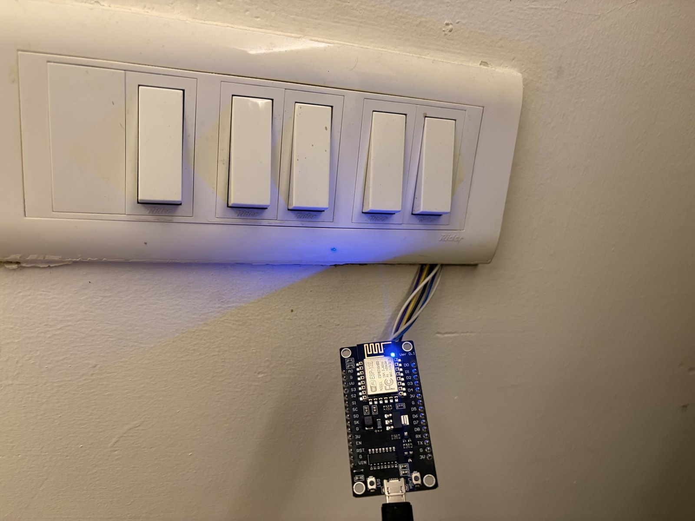
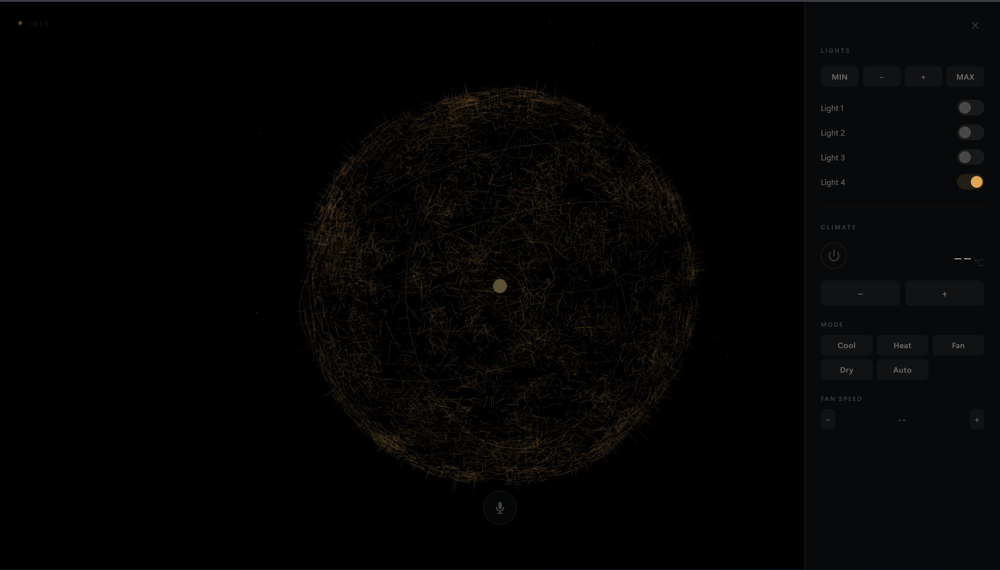
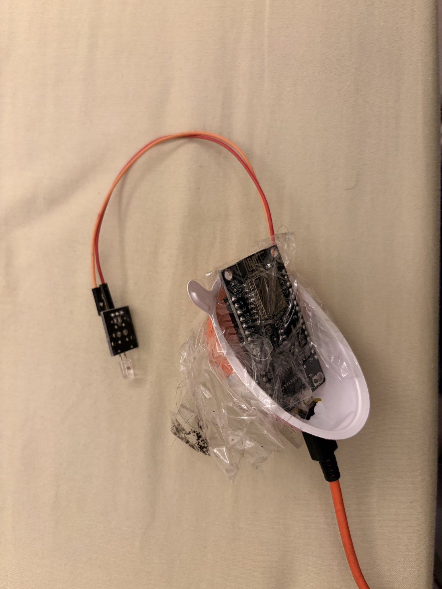
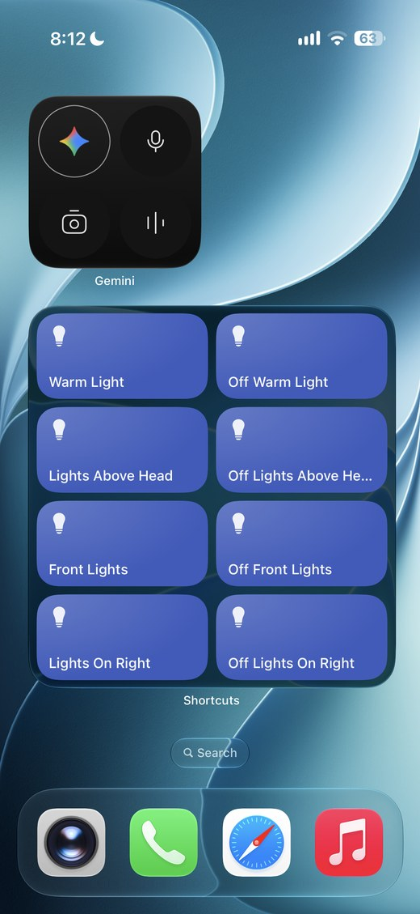

<h1 align="center">Citra</h1>

<p align="center">
  <b>A voice assistant that runs your flat and your PC.</b><br>
  Real switchboards over WiFi. Real Windows control. Speech in and out
  on your own machine.<br>
  <b>No subscription. Lights and AC keep working when the internet doesn't.</b>
</p>

<p align="center">
  
  
  
  
  
</p>

<p align="center">
  
</p>
<p align="center">
  <i>This is the whole idea. About ₹250 of parts behind an ordinary switchboard.<br>
  Leave the wall switch on, and that light now answers to your voice,<br>
  your phone, or a schedule.</i>
</p>

---

```
  "Citra, turn on the lights"          → a physical relay clicks
  "Citra, what's on my screen?"        → a local model looks and answers
  "Citra, block instagram"             → blocked, until you say otherwise
  "Citra, write me a python script..." → it appears in Notepad, ready to run
  "Citra, turn on the warm light at 6am" → scheduled
```

Not smart bulbs. **Your existing switchboards**, rewired with a NodeMCU
and a relay board behind each one — about **₹250–300 a switchboard**
in parts. The AC's IR blaster was another ₹200. Nothing to pay anyone
monthly.

---

## What it looks like

<p align="center">
  
</p>

<p align="center">
  <i>The dashboard. Every switch in the flat, the AC, and a mic button —<br>
  installs to your phone's home screen like an app.</i>
</p>

---

## What it does

**44 tools.** All of them are in this repo, none are on a roadmap.

### 🏠 Runs your actual flat — 17 tools
Lights, fans and TV through relays wired into real switchboards across
11 boards (bedrooms, hall, kitchen, bathroom). Air conditioner over IR:
power, temperature, mode.

<p align="center">
  
</p>
<p align="center">
  <i>The AC controller: an ESP8266 and an IR LED, about ₹200 the pair.<br>Not pretty. Works.</i>
</p>

**It works with the internet down.** A light or AC command never leaves
your WiFi — a local pattern match, then a direct call to the board.
Alexa cannot do this.

### 🖥️ Runs your PC — 15 tools
Open apps, files, or a whole **layout** at once. **Install and uninstall
software** silently via winget. **Block a website** while you study, and
unblock it later. Lock the screen, screenshot, force-quit something
frozen, dark mode, brightness, search your files.

### 👁️ Sees your screen — locally — 4 tools
A vision model on **your own machine** — no screenshot ever leaves it.
Ask what's on screen and it reads it. It can also **click**, **type**
and **press keys** based on what it sees.

### 💻 Writes code
*"write me a python script that renames all my photos by date"* — the
code opens in Notepad, ready to run. A fast model by default, a much
larger one when you ask for something big.

### ⏰ Remembers and schedules — 4 tools
Spoken reminders, and **scheduled room actions**: *"turn on the
warm light at 6am"*. List what's pending, cancel any of it.

### 📱 Phone dashboard — and one-tap iPhone Shortcuts
Installs to your home screen like an app. Every switch, the AC, live
state. Type to it instead of talking, and have it read replies aloud.

The `/api/*` routes are one-shot HTTP with a shared token, built for
**iOS Shortcuts** and Android's equivalents — so any switch becomes a
button on your home screen, no app to install and no cloud in between.

<p align="center">
  
</p>
<p align="center"><i>Real lights, real home screen, one tap each.</i></p>

### 🗣️ Speech that isn't annoying
Wake word **"Hey Citra"**, Whisper transcription and neural TTS — all
**on-device**. She explains *why* she's slow instead of leaving dead
air, and says nothing at all when the answer is quick. **Mute means
muted**, it expires on its own, and no feature can talk over it.

---

## How it's built

```
     "Hey Citra"                        wake word   ── openWakeWord (local)
          │
          ▼
     your voice ──────────────────────► speech-to-text ── faster-whisper (local)
          │
          ▼
     ┌─────────────────────────────────────────────┐
     │  FAST PATH   regex → the board. no internet │
     │  SMART PATH  an LLM with 44 tools           │
     └─────────────────────────────────────────────┘
          │                    │                 │
          ▼                    ▼                 ▼
     relay boards          your PC          your screen
     (ESP8266, WiFi)     (15 tools)      (local vision model)
          │
          ▼
     spoken reply ─────────────────────► Piper TTS (local)
```

Two paths on purpose. *"Turn on the lights"* is a regex and a WiFi call —
it must not wait on a model. Anything else goes to the LLM with the full
tool set.

**Run `python citra_doctor.py`** and it checks every subsystem in about
ten seconds: Python, imports, each board, the AI backends, the audio
devices, the ports.

---

## Getting started

```bash
git clone https://github.com/AbhayPhalswal/citra
cd citra
python -m venv jarvis_venv && jarvis_venv\Scripts\activate
pip install -r requirements.txt
python -m piper.download_voices en_US-amy-medium
setx GEMINI_API_KEY "your-key"        # free tier is fine
python citra_doctor.py                 # check everything first
python jarvis_voice_assistant.py
```

The hardware side is optional — everything on your PC works without a
single relay attached.

**For the flat:** flash `relay_server/` and `ac_ir_server/` to an
ESP8266. Copy `wifi_secrets.example.h` to `wifi_secrets.h` in each
sketch folder and put your network in it — that file is gitignored, so
your password never ends up in a commit. Give each board a DHCP
reservation, then list them in `citra_devices.json` (copy
`citra_devices.example.json`).

---

## ⚠️ Read this before you expose it

`run_command` runs **arbitrary shell commands**, driven by an LLM. That
is deliberate — it is what makes *"Citra, do X on my computer"* work for
things nobody wrote a tool for. It also means:

- **The dashboard binds to loopback only.** It refuses to start on any
  other interface without `CITRA_ALLOW_REMOTE=1`. Do not set that unless
  you understand exactly what you are opening.
- **PC tools are not on the phone API at all** — voice and local chat
  only. The token-gated API reaches lights and the AC, nothing else.
- The API token is generated on first run and gitignored.

If you put this on the open internet, you are handing out a shell on
your PC. Don't.

---

## Why it exists

I wanted my room to work by voice without paying a subscription or
sending my flat's state to somebody else's server. Then my neighbours
wanted it too.

Most of the hard parts turned out not to be the AI. They were mains
wiring behind a switchboard, IR timing, an ESP8266 that handles one
request at a time on very little RAM, DHCP conflicts, and Windows audio
routing. The code says so — every module explains **why** it is written
the way it is, including the bugs that shaped it.

Built by a first-year Data Science & AI student, for one flat in Delhi.

## License

MIT — do what you like with it.
